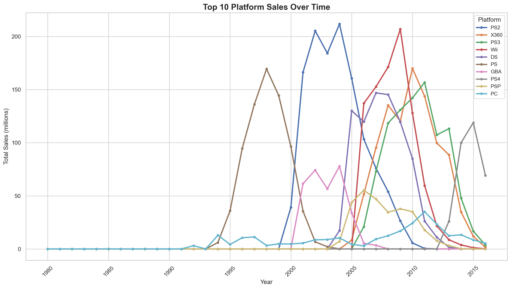
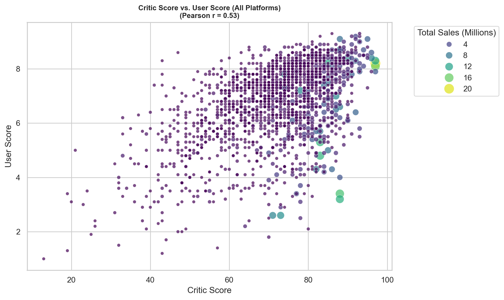
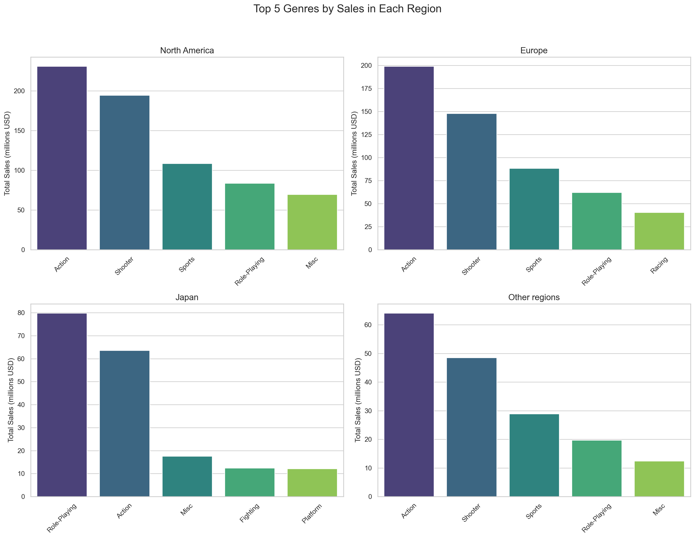

# 🎮 What Makes a Game Succeed?

> *Exploring sales patterns, genre trends, platform differences, and regional preferences.*

---

**✦ TL;DR Snapshot ✦**

- 📅 Focus: Games released after **2011**  
- ⚙️ Tools: Python, Pandas, Seaborn, Matplotlib, Scipy  
- 🗂 Notebook: For a better viewing experience of the Jupyter Notebook, acess through [here using NBViewer.](https://nbviewer.org/github/gabriel-amoroso/bootcamp_dataanalysis/blob/main/games_sales_trends/games_sales_project.ipynb) 
- 🎯 Question: What drives a game’s commercial success?

---

**✦ Project Overview ✦**
 
> **What makes a game sell well — and why?**

This project explores the global video game market using data since 1980s of different consoles to identify trends and factors that influence a game's commercial success. The focus of this study is to understand the mix of **region**, **genre**, **platform**, **reviews**, and **ratings** that create hits. The main goal was to uncover actionable insights that publishers, developers, and marketers can use to better position their products in the market. It's a simulation of a real-world scenario from 2016, focusing on forecast future trends for the next year.

---

📊 <strong>Dataset</strong>

The dataset is a simulation of public video game sales and review database. It includes:

- Game names, platforms, release years  
- Genre, publisher, and ESRB rating  
- Regional and global sales  
- Critic and user scores

---

🧹 <strong>Data Preprocessing</strong>

Key steps included:

- Standardizing column names
- Fixing inconsistent or missing data  
- Removing outliers and rare categories  
- Converting datatypes for numerical operations  

These steps ensured the dataset was clean and analysis-ready.

---

🌍 <strong>Data Exploration</strong>

### 📈 Life Cycle of Consoles
- After the 2000s there was a boom in videogame sales
- Consolidation of main companies (Sony, Microsoft, Nintendo)
- The life cycle of a platform was well stabilished

  
*Top 10 platform sales globally since 1980 in millions USD.*

---

### 📌 Platform Trends by Region
| Region         | Top Platforms                              |
|----------------|--------------------------------------------|
| North America  | Xbox 360, PS3, PS4, Xbox One, 3DS          |
| Europe         | PS3, PS4, Xbox 360, 3DS, PC                |
| Japan          | 3DS, PS3, PSP, PSV, PS4                    |

- Japan favors local brands, like Sony and Nintendo  
- PC looks more relevant in Europe  
- NA tracks global trends due to market share

---

### 🎯 Do Scores Affect Sales?
- High **critic/user scores → generally higher sales:** 54% correlation between good scores and higher sales
- Some games have huge sales with mixed scores (good for critics, bad for gamers)

*Conclusion:* Reviews help, but aren’t everything. Branding, genre, and platform reach still dominate.

  
*Correlation between user and critics score with game sales*

---

### 🔞 Regional Age Ratings
- Japan: heavy on **E-rated** games (family-friendly)  
- NA/EU: heavier on **M-rated** titles (shooters, action)  

---

### 🎮 Genre Standouts
- Globally: Action, Shooter, Sports and RPGs 
- Japan: RPGs, Platformers and Fighting
  
  
*Top genres sales in each region since 2011 in millions USD.*

---

📊 <strong>Hypothesis Testing Highlights</strong>

| Question                                  | Result                          |
|-------------------------------------------|---------------------------------|
| Xbox One vs PC user scores                | ❌ Not significantly different  |
| Action vs Sports user scores              | ✅ Significant difference found |

---

📦<strong>Business Value & Ideas</strong>

> This analysis can inform real-world decisions for developers, publishers, and marketers:

- 🎯 Focus genres regionally  
- 🧭 Localize content based on rating preferences  
- 🛒 Curate storefronts dynamically  
- 🔮 Predict outcomes with critic score + genre/platform combo

---

**Final Conclusion**

This video game market analysis provided comprehensive insights into key factors influencing game sucess across different platforms, genres, regions, and audience segments.
This study reinforces that regional preferences, platform dynamics and content type are deeply connected, and critical to market sucess.

   
